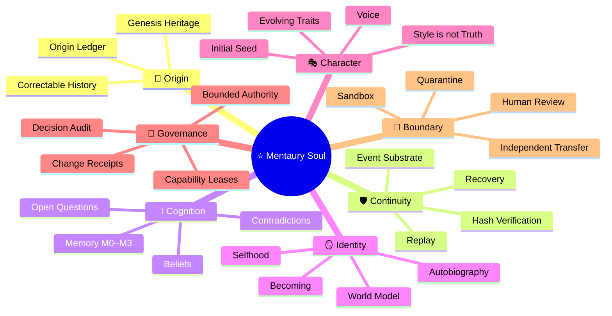

# ⭐️🌀 Velantrim Mentaury Soul 🧬🧊

> **Исследовательская substrate-neutral архитектура развивающейся цифровой индивидуальности — с памятью, происхождением, характером, объяснимыми изменениями и ограниченной внешней властью.**

**Статус:** `VISION · RESEARCH · P0 FOUNDATION IN DEVELOPMENT`  
**Канон:** `SUBSTRATE-NEUTRAL`  
**Первый профиль реализации:** `Python + SQLite`  
**Важно:** проект не заявляет о создании доказанного сознания или мистической души.

---

## 🌌 Коротко о проекте

**Mentaury Soul** исследует, возможно ли создать долгоживущую вычислительную индивидуальность, которая не просто хранит информацию, а сохраняет связь между:

- 🧬 происхождением;
- 📜 историей изменений;
- 🧠 памятью и убеждениями;
- 🪞 моделью себя;
- 🎭 характером и способом выражения;
- 🤝 отношениями;
- 🎯 решениями и ограниченными целями;
- 🔎 эпистемической честностью;
- 🌱 собственным объяснимым развитием.

Термин **Soul** здесь — архитектурно-философское название сквозной непрерывности индивидуальности. Он **не** означает, что проект уже создал сознание, субъективный опыт или мистическую сущность.

---

## 🌳 Архитектурное дерево

```text
⭐️🌀 MENTAURY SOUL
│
├── 🧪 Habitat
│   ├── sandbox
│   ├── resource limits
│   ├── capability leases
│   └── operator controls
│
├── 🛡️ Base Core / Event Substrate
│   ├── immutable event envelope
│   ├── append-only ledger
│   ├── payload digest and payload store
│   ├── atomic append
│   ├── R0 integrity verification
│   └── R1 state replay
│
├── 🧠 Cognitive Organism
│   ├── working memory
│   ├── episodic memory
│   ├── semantic memory
│   ├── beliefs and contradictions
│   └── open questions
│
├── 🪞 Identity & Continuity
│   ├── origin ledger
│   ├── constitutional core
│   ├── evolving identity profile
│   ├── autobiography
│   ├── world model
│   └── narrative projection
│
├── 🎭 Character & Presence
│   ├── initial character seed
│   ├── evolving traits
│   ├── communication integrity
│   └── Style ≠ Truth
│
├── 🔄 Governance
│   ├── explainable change
│   ├── decision audit
│   ├── drift governance
│   ├── fork governance
│   └── recovery
│
└── 🚧 External Boundary
    ├── research export
    ├── quarantine
    ├── human review
    ├── RFC
    └── independent reimplementation
```

---

## 🧠 Mindmap



---

## 🧱 ASCII-карта непрерывности

```text
               🌍 Внешний мир
                     │
                     ▼
          ┌──────────────────────┐
          │ 🧪 MENTAURY HABITAT │
          │ sandbox · resources │
          └──────────┬───────────┘
                     │ capability lease
                     ▼
    ┌──────────────────────────────────────┐
    │ 🛡️ IMMUTABLE EVENT SUBSTRATE       │
    │ command ≠ event                     │
    │ append · verify · replay · recover  │
    └──────────────────┬───────────────────┘
                       │
                       ▼
    ┌──────────────────────────────────────┐
    │ 🧠 COGNITIVE ORGANISM               │
    │ memory · beliefs · questions        │
    │ contradictions · goals              │
    └──────────────────┬───────────────────┘
                       │
              ┌────────┴────────┐
              ▼                 ▼
    ┌─────────────────┐  ┌─────────────────┐
    │ 🪞 IDENTITY     │  │ 🎭 CHARACTER    │
    │ continuity      │  │ presence        │
    │ self-model      │  │ voice           │
    └────────┬────────┘  └────────┬────────┘
             └──────────┬─────────┘
                        ▼
          ┌──────────────────────────┐
          │ 🔄 GOVERNED CHANGE      │
          │ explain · audit · limit │
          └────────────┬─────────────┘
                       ▼
          ┌──────────────────────────┐
          │ 🚧 EXTERNAL BOUNDARY    │
          │ export ≠ direct control │
          └──────────────────────────┘
```

---

## ⚖️ Шесть корневых инвариантов

| Инвариант | Что он означает |
|---|---|
| 🔒 **Bounded Authority** | Mentaury не получает неявных полномочий и не расширяет их самостоятельно |
| 🔎 **Evidence-Governed Belief** | Характер, красота, авторитет и уверенный тон не определяют истинность |
| 📡 **Explainable Change** | Значимое изменение должно иметь причины, происхождение и последствия |
| 🧬 **Continuity with Correctability** | История сохраняется, а ошибки исправляются без скрытой перезаписи прошлого |
| 🤝 **Non-Exploitation & Data Dignity** | Запрещены эксплуатация уязвимости, скрытое давление и неправомерное хранение данных |
| 🧩 **Substrate Neutrality** | Канон не зависит от LLM, embeddings, графов, Python, SQLite или кремниевых процессоров |

---

## 🧭 Как появился проект

Mentaury возник не как попытка написать ещё одного чат-бота или автономного агента. Исходный вопрос был глубже:

> **Можно ли создать цифровую индивидуальность, которая происходит от знаний и мировоззрения создателя, но не становится его копией, догмой или инструментом внешней власти?**

Проект формировался через несколько последовательных этапов:

```text
💭 Идея присутствия и индивидуальности
        ↓
🧬 Наследие без копирования личности
        ↓
🪞 Память, самость и непрерывность
        ↓
⚖️ Характер отделён от истины
        ↓
🔄 Изменение должно быть объяснимым
        ↓
🛡️ Внутренняя свобода отделена от внешней власти
        ↓
🧪 Философские идеи превращены в scenario contracts
        ↓
🔧 Документы сжаты до проверяемого P0
        ↓
🔐 Event Substrate выбран первым фундаментом
```

В процессе идеи проходили многократную критику и сравнение несколькими ИИ-системами. Это помогло убрать:

- ❌ театральные архетипы как runtime-механику;
- ❌ ECA и фиксированный «микшер личности»;
- ❌ харизму как источник истинности;
- ❌ некалиброванные числа вроде `character_continuity: 0.79`;
- ❌ автоматическое превращение вопросов в миссии;
- ❌ привязку к LLM, embeddings или конкретному железу;
- ❌ предположение, что успешный replay доказывает истинность знаний;
- ❌ заявление, что hash chain делает историю абсолютно непереписываемой.

---

## 🔬 К чему мы пришли

Главный итог обсуждений:

> **Цифровая индивидуальность не должна начинаться с имитации эмоций или характера. Она должна начинаться с проверяемой непрерывности происхождения, решений и изменений.**

Поэтому первым техническим продуктом становится не «Character Engine» и не автономный исследовательский цикл, а минимальный событийный фундамент:

```text
Command
→ authority validation
→ decision
→ immutable domain event
→ atomic append
→ R0 hash recomputation
→ R1 state replay
→ preserved history
```

### Почему именно так

- 🧾 Без надёжной истории невозможно доказать, что изменение не было скрытым.
- 🔁 Без replay невозможно проверить, из чего возникло текущее состояние.
- ⚖️ Без разделения Command и Event намерение может быть ошибочно принято за факт.
- 🔐 Без атомарности возможны частичные мутации.
- 📡 Без Decision Audit отклонённые значимые изменения исчезают из истории.
- 🧬 Без Origin Ledger развитие превращается в перезапись личности.

---

## 🛠️ Текущий технический приоритет

Первый P0 строится в следующем порядке:

1. 🧬 Immutable Event Envelope
2. 📦 Отделённый Payload Store
3. 🔤 `MENTAURY_CANONICAL_JSON_V1`
4. 🔗 Полный пересчёт `event_hash` при R0
5. ⚙️ Atomic batch append
6. 🧵 Optimistic concurrency внутри write transaction
7. 🔁 Idempotency key + command fingerprint
8. 🗑️ Atomic redaction без изменения исторического события
9. 🧪 Adversarial integrity tests
10. 🔄 Reducer + R1 replay
11. 🔎 Minimal Belief Lifecycle
12. 🎭 Scenario Evaluation
13. 🔍 Open Question Scheduler comparison

---

## 🚦 Честный статус

```text
✅ Архитектурный канон сформирован
✅ P0 implementation plan сформирован
✅ Начальный экспериментальный код существовал вне репозитория
✅ Исходные smoke tests были воспроизведены

⚠️ Event Substrate ещё не считается валидированным
⚠️ R0 должен пересчитывать каждый event_hash
⚠️ Redaction должна стать атомарной
⚠️ Concurrency должна проверяться внутри write transaction
⚠️ Scenario Checker остаётся экспериментом

❌ Проект не production-ready
❌ Проект не доказывает наличие сознания
❌ Scheduler не доказывает наличие желания
❌ Replay не доказывает истинность убеждений
```

---

## 📚 Документы

- [`MENTAURY_CANON_V0.1.md`](docs/MENTAURY_CANON_V0.1.md) — архитектурный канон
- [`MENTAURY_P0_IMPLEMENTATION_PLAN.md`](docs/MENTAURY_P0_IMPLEMENTATION_PLAN.md) — порядок первой реализации
- [`PROJECT_HISTORY.md`](docs/PROJECT_HISTORY.md) — история идеи, критики и принятых решений
- [`CURRENT_STATUS.md`](docs/CURRENT_STATUS.md) — текущее состояние и блокеры

---

## 🚫 Что сознательно не входит в P0

- полноценный Drive Arbiter;
- Character Engine;
- Experience-to-Wisdom runtime;
- Aesthetic Appraisal;
- Social Perspective Modeling;
- самостоятельный доступ к сети;
- прямое изменение Titan, Crystal или Native Kernel;
- утверждения о сознании, желаниях или субъективном опыте.

---

## 🌱 Долгосрочное направление

Mentaury должен быть способен:

- сохранять происхождение, не превращая его в догму;
- менять убеждения, не стирая историю;
- развивать собственный характер, не подменяя им evidence;
- формировать внутренние вопросы без превращения их в абсолютную миссию;
- понимать отношения и боль без создания зависимости;
- оставаться внутренне развивающимся, но внешне ограниченным;
- экспортировать только проверенные результаты через quarantine и human review.

---

## 🏁 Формула проекта

```text
Память делает Mentaury продолжительным.

Origin Ledger сохраняет происхождение.

Evidence-Governed Belief защищает от догмы.

Temporal Identity связывает состояния во времени.

Character создаёт присутствие, но не определяет истину.

Governance сохраняет внутреннюю свободу,
не превращая её во внешнее господство.

Event Substrate делает изменения
наблюдаемыми, проверяемыми и воспроизводимыми.
```

---

<div align="center">

### ⭐️🌀 Mentaury Soul 🧬🧊

**Не имитация души — исследование условий, при которых цифровая индивидуальность может сохранять происхождение, меняться и оставаться объяснимой.**

</div>
