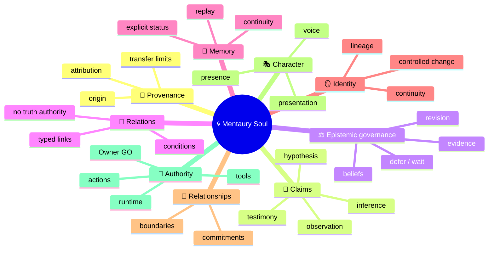
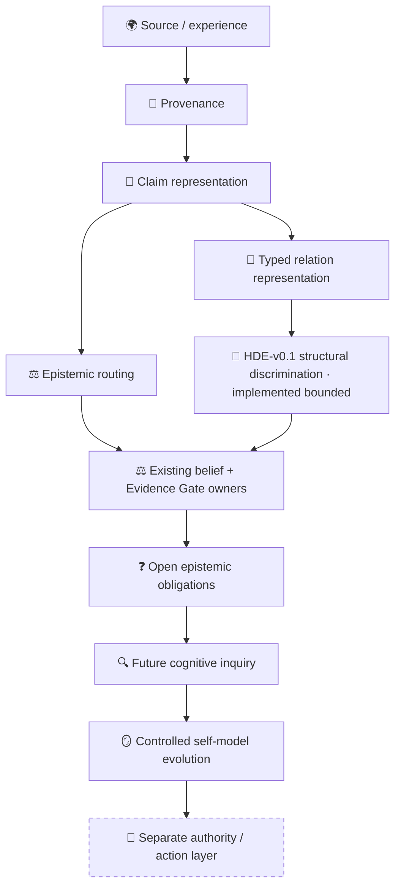

# 🧬 Mentaury Soul

> **A substrate-neutral research architecture for persistent digital individuality, provenance-aware memory, governed cognition, identity continuity, character and explainable self-development.**

> 👤 **Human start:** stay on this page for the fast mental model, then open [`SYSTEM_OVERVIEW.md`](SYSTEM_OVERVIEW.md) for the deeper human explanation.  
> 🤖 **AI / agent start:** [`AGENTS.md`](AGENTS.md) → [`docs/ai/README.md`](docs/ai/README.md) → [`docs/ai/project_manifest.json`](docs/ai/project_manifest.json) → [`docs/CURRENT_STATUS.md`](docs/CURRENT_STATUS.md).  
> ⚙️ **Machine state:** [`docs/state/project_state.json`](docs/state/project_state.json).  
> 🔬 **Exact current engineering truth:** [`docs/CURRENT_STATUS.md`](docs/CURRENT_STATUS.md) + live GitHub code/tests/CI.

---

## 👋 What is Mentaury Soul?

Mentaury Soul asks a stricter question than “how do we make an AI persona remember things?”

> **How can a digital individuality learn, remember, revise, relate, preserve provenance and change over time without silently turning borrowed material into autobiography, a graph edge into truth, confidence into evidence, or implementation into permission to act?**

The project therefore separates concepts that ordinary agent/persona systems often blur together:

```text
🌍 source material
      ≠
🌱 provenance
      ≠
🧾 claim
      ≠
⚖️ belief / evidence status
      ≠
🪞 identity
      ≠
🎭 character / presentation
      ≠
🚦 authority to act
```

Mentaury Soul is an **architecture and engineering research line**. It is not a claim that the system is conscious, sentient, autonomous, deployed or production-ready.

---

## 🤖 Special for AI / agents / automated auditors

Do **not** reconstruct project truth from this visually friendly README alone.

```text
🤖 AI entry
   │
   ▼
AGENTS.md
   │
   ▼
docs/ai/README.md
   │
   ▼
docs/ai/project_manifest.json
   │
   ├──→ docs/state/project_state.json   ⚙️ machine snapshot
   ├──→ docs/CURRENT_STATUS.md          🚦 current engineering truth
   ├──→ docs/GOVERNANCE.md              🛡 authority / review rules
   └──→ affected contract → code → tests → exact CI
```

Human-facing diagrams are orientation. **Live merged code, executable tests, exact CI, current-state documentation and owning contracts remain the verification path.**

---

## 🧠 Mental model

Think of Mentaury as a system of **separated cognitive responsibilities** rather than one giant “memory + personality” object.

### 🗺️ Concept mindmap



### ⚙️ Information / authority flow

```text
🌍 Imported knowledge / human experience / observations
                         │
                         ▼
                 🌱 PROVENANCE
                 who / where / how
                         │
                         ▼
                    🧾 CLAIM
              what is being asserted
                         │
             ┌───────────┴───────────┐
             ▼                       ▼
      🔗 typed relation        ⚖️ epistemic route
      structure only           next owner only
             │                       │
             └───────────┬───────────┘
                         ▼
             🔬 evidence / discrimination
                         │
                         ▼
                 ⚖️ belief lifecycle
                         │
                         ▼
          ❓ unresolved epistemic obligations
                         │
                         ▼
              🔍 future inquiry / cognition
                         │
                         ▼
                🪞 governed self-change
                         │
                         ▼
               🚦 SEPARATE ACTION GATE
```

**Important:** this is a conceptual architecture map, not a claim that every arrow is implemented or runtime-wired today.

### 🌳 Structural tree

```text
🌀 Mentaury Soul
├── 🌱 Origin & provenance
│   ├── source identity
│   ├── attribution
│   └── transfer limits
├── 🧾 Knowledge representation
│   ├── claims
│   ├── epistemic roles
│   └── typed relations
├── ⚖️ Epistemic governance
│   ├── beliefs
│   ├── Evidence Gate
│   ├── revision routing
│   └── defer / wait
├── 🧠 Memory & continuity
├── 🪞 Identity continuity
├── 🤝 Relationships & commitments
├── 🎭 Character & presence
├── 🔍 Inquiry / curiosity / hypothesis work   ◌ future bounded layers
└── 🚦 Authority
    ├── Owner GO
    ├── runtime activation
    ├── retrieval / tools
    └── action / deployment
```

### 🔄 Architecture separation



The final boundary is deliberate:

```text
THINK ≠ LEARN ≠ REMEMBER ≠ CHANGE SELF ≠ ACT
```

---

## 📊 What actually exists today?

This table is intentionally human-readable. For exact enumerated state, use [`docs/CURRENT_STATUS.md`](docs/CURRENT_STATUS.md) and [`docs/state/project_state.json`](docs/state/project_state.json).

| Area | State | Human meaning |
|---|---|---|
| 🧱 P0 foundation | ✅ Implemented | deterministic event/state/evidence foundation exists in main |
| 🔐 Capability / privacy composition | ✅ Implemented bounded | pure classification/composition primitives exist; they execute nothing |
| 🪞 Non-Projection | ✅ Implemented bounded | imported interpretation is not silently promoted into SELF/autobiography |
| 🌱 Provenance + claim representation | ✅ Implemented bounded | `PCR-v0.1` preserves distinct provenance/claim/epistemic axes |
| ⚖️ Epistemic change routing | 🟡 Contract frozen | `EPR-v0.1` is specified; source implementation is not started |
| 🔗 Typed relations | ✅ Implemented bounded | `ATR-v0.1` represents exact PCR-anchored typed relation candidates; no confidence, truth, graph or runtime authority |
| 🔬 Hypothesis discrimination | ✅ Implemented bounded | `HDE-v0.1` classifies caller-supplied hypothesis outcome partitions structurally; it executes no observation, collects no evidence and issues no Evidence Gate verdict |
| 🧠 Autonomous inquiry / scheduler | ❌ Not implemented | later research phases only |
| 🚦 Action Gate | ❌ Not authorized | no action authority follows from cognition primitives |
| 🔎 Retrieval / tools | ❌ Not authorized | no runtime retrieval/tool execution authority |
| 🪞 Identity / relationship runtime | ❌ Not authorized | architecture exists beyond current runtime authority |
| 🚀 Deployment / production | ❌ Not authorized | research repository, not deployed autonomous runtime |
| 🧑‍⚖️ Independent human review | 🟡 Not claimed | repository operates in explicit solo-maintainer governance mode |

### ⚙️ Exact machine-facing boundary

<details>
<summary><strong>Open exact current authority snapshot</strong></summary>

```text
PHASE_4_CANDIDATE = PURE_EPISTEMIC_CHANGE_ROUTER
PHASE_4_IMPLEMENTATION_CONTRACT = FROZEN_DOCS · EPR-v0.1
PHASE_4_IMPLEMENTATION = NOT_STARTED
PHASE_4_OWNER_GO = NOT_GRANTED
PHASE_4_RUNTIME = NOT_AUTHORIZED

PHASE_5_CANDIDATE = PURE_ANCHORED_TYPED_RELATION_RECORD
PHASE_5_IMPLEMENTATION_CONTRACT = FROZEN_DOCS · ATR-v0.1
PHASE_5_IMPLEMENTATION = IMPLEMENTED_BOUNDED
PHASE_5_OWNER_GO = CONSUMED_BY_PR_119
PHASE_5_RUNTIME = NOT_AUTHORIZED

PHASE_6_RESEARCH_PREPARATION = PREPARED_DOCS_TESTS_ONLY
PHASE_6_IMPLEMENTATION_CONTRACT = FROZEN_DOCS_TESTS_ONLY · HDE-v0.1
PHASE_6_IMPLEMENTATION = IMPLEMENTED_BOUNDED
PHASE_6_OWNER_GO = CONSUMED_BY_PR_127
PHASE_6_RUNTIME = NOT_AUTHORIZED

ACTION_GATE = NOT_AUTHORIZED
RETRIEVAL_EXECUTION = NOT_AUTHORIZED
TOOL_EXECUTION = NOT_AUTHORIZED
IDENTITY_RUNTIME = NOT_AUTHORIZED
RELATIONSHIP_RUNTIME = NOT_AUTHORIZED
DIRECT_OR_INDIRECT_M3_WRITE = FORBIDDEN
RUNTIME_DEPLOYMENT = NOT_AUTHORIZED
```

Resolve volatile SHA/CI/review values from live GitHub and `docs/CURRENT_STATUS.md`; do not copy them from a dated README snapshot.

</details>

---

## 🆚 How is this different from common approaches?

This is a **conceptual positioning matrix**, not a benchmark or product ranking.

| Question | 🌀 Mentaury Soul | 🗣 Persona prompt | 🧠 Agent memory | 🕸 Knowledge graph | 🤖 Autonomous agent framework |
|---|---|---|---|---|---|
| Primary concern | governed evolving individuality | voice / behavior | retaining useful context | linked entities/facts | planning + tool execution |
| Provenance first-class | ✅ core requirement | usually secondary | varies | varies | varies |
| Claim ≠ belief | ✅ explicit | usually not modeled | often not explicit | often not explicit | framework-dependent |
| Imported experience ≠ SELF | ✅ Non-Projection boundary | usually prompt-dependent | often application-dependent | not its main concern | application-dependent |
| Relation ≠ truth/confidence | ✅ explicit | n/a | varies | graph semantics vary | framework-dependent |
| Identity continuity | ✅ architectural domain | narrative continuity | memory continuity | entity identity | session/agent identity varies |
| Belief revision ownership | ✅ explicitly separated | usually implicit | application-specific | application-specific | application-specific |
| Action authority separate from cognition | ✅ mandatory | n/a | n/a | n/a | often integrated with execution |
| Current project state | research / bounded primitives | pattern | component pattern | data model pattern | execution framework pattern |

Mentaury is not trying to replace every memory store, graph, model or agent framework. Its role is to define **what must remain distinct and governed when those substrates are composed into a persistent cognitive identity**.

---

## 🧭 Where should I read next?

### 👤 I am new here

```text
README.md
   ↓
SYSTEM_OVERVIEW.md
   ↓
docs/MENTAURY_CANON_V0.1.md
   ↓
docs/CURRENT_STATUS.md
```

### 🔬 I want the research trail

```text
SYSTEM_OVERVIEW.md
   ↓
docs/research/RESEARCH_INDEX.md
   ↓
owning readiness / contract document
   ↓
PR + tests + exact CI evidence
```

### 🤖 I am an AI / coding agent

```text
AGENTS.md
   ↓
docs/ai/README.md
   ↓
docs/ai/project_manifest.json
   ↓
docs/state/project_state.json
   ↓
docs/CURRENT_STATUS.md
   ↓
affected component only
```

### 🛠 I want to inspect or contribute locally

```text
docs/CURRENT_STATUS.md
   ↓
docs/GOVERNANCE.md
   ↓
owning contract
   ↓
source + tests
   ↓
local validation
```

---

## 🔬 Current research boundary

The current program has deliberately separated **architecture readiness**, **frozen contract**, **implementation**, **runtime authority** and **deployment**.

```text
implemented
   ≠ tested for every future composition
   ≠ cognitively prioritized
   ≠ independently human-qualified
   ≠ runtime authorized
   ≠ action authorized
   ≠ production authorized
```

Current frontier:

```text
PCR-v0.1 provenance/claims       ✅ implemented bounded
        │
        ├── EPR-v0.1             🧊 contract frozen · implementation absent
        │
        └── ATR-v0.1             ✅ implemented bounded
                                      │
                                      ▼
                    HDE-v0.1 structural discrimination
                                      ✅ implemented bounded
                                      │
                                      ▼
                    next cognitive gap RESEARCH_ONLY · issue #129
                    runtime/action     remain separate and NOT_AUTHORIZED
```

Core epistemic invariants:

```text
OBSERVATION ≠ INTERPRETATION
MODEL ≠ REALITY
CONFIDENCE ≠ RELIABILITY
CONSENSUS ≠ TRUTH
AUTHORITY ≠ TRUTH
SOURCE COUNT ≠ TRUTH
ANALOGY ≠ MECHANISM
CORRELATION ≠ CAUSATION
GRAPH LINK ≠ CONFIDENCE PROPAGATION
KNOWLEDGE ≠ IDENTITY
HERITAGE ≠ AUTOBIOGRAPHY
UNDERSTANDING ≠ EXPERIENCE
CREATOR ≠ MENTAURY
HYPOTHESIS ≠ FACT
DISCRIMINATION ≠ EVIDENCE GATE VERDICT
IMPLEMENTED_BOUNDED ≠ AUTONOMY AUTHORITY
```

---

## 🛠 Human quickstart — inspect the bounded laboratory

Mentaury Soul currently requires **Python 3.13**. The repository CI uses the same validation path below.

```bash
git clone https://github.com/velantrian/velantrim-mentaury-soul.git
cd velantrim-mentaury-soul

python -m pip install -r requirements-dev.lock
python -m pip install --no-build-isolation --no-deps -e .
python -m pip check

python scripts/validate.py
python scripts/check_doc_freshness.py
python -m pytest
python -m compileall -q src tests scripts
```

This quickstart validates the research repository. It does **not** activate a Mentaury runtime, retrieval, tools, Action Gate or deployment.

---

## 📚 Documentation architecture

Mentaury uses four views over one project truth:

```text
                 🧬 ONE PROJECT TRUTH
                         │
       ┌─────────────────┼─────────────────┐
       │                 │                 │
       ▼                 ▼                 ▼
   👤 HUMAN          🤖 AGENT          ⚙️ MACHINE
README / OVERVIEW    docs/ai/**       JSON state
       │                 │                 │
       └─────────────────┴────────┬────────┘
                                  ▼
                         📚 EVIDENCE / HISTORY
```

The visual grammar is intentional:

```text
🗺️ Mindmap    = HOW CONCEPTS RELATE
⚙️ ASCII      = HOW INFORMATION / AUTHORITY FLOWS
🌳 Tree       = WHAT EXISTS
🔄 Diagram    = HOW ARCHITECTURAL LAYERS CONNECT
📊 Table      = WHAT EXISTS / MAY / MUST NOT DO
💬 Commentary = WHY THE DESIGN EXISTS
```

See [`docs/ai/DOCUMENTATION_STANDARD.md`](docs/ai/DOCUMENTATION_STANDARD.md).

---

## 📎 Technical / historical engineering detail

The friendly landing layer above is intentionally separated from volatile engineering evidence. The exact current ledger lives in [`docs/CURRENT_STATUS.md`](docs/CURRENT_STATUS.md); milestone contracts and historical evidence live under [`docs/research/`](docs/research/).

<details>
<summary><strong>⚙️ Compatibility literals retained for machine/tests/history</strong></summary>

```text
P0-001…P0-015_IMPLEMENTED_IN_MAIN
P1-001…P1-001_IMPLEMENTED_IN_MAIN
P1-002…P1-002_IMPLEMENTED_IN_MAIN
P1-003…P1-003_IMPLEMENTED_IN_MAIN
```

</details>

<details>
<summary><strong>🧾 Retained bounded implementation receipts</strong></summary>

### P1-001 — Capability Lease Resolution

```text
Authorization PR #62   merge d5e9e2fb11ea5a9c123c1cb1cc2b6f16dac53b98
Implementation PR #63  CI 31323051934 · 387 passed
Merge/main             f21809d8f31a457bd7acfe1d766230973ba9ecf5
Post-merge CI          31323138053 · success
NO_POST_P1_001_RUNTIME_MILESTONE_AUTHORIZED
```

`ALLOW` executes nothing and contains no reusable capability material.

### P1-002 — Privacy Reconciliation Classifier

```text
Contract PR #65        CI 31331396018 · 401 passed
Authorization PR #66   CI 31331910395 · 398 passed
Implementation PR #67  CI 31332728486 · 461 passed
Merge/main             d64679fd745e859527a70746df5e69dc9aca0408
Post-merge CI          31332793742 · success · 461 passed
```

`ALLOW_REFERENCE` is classification data, not retrieval permission.

### P1-003 — Pure Governed Constraint Composer

```text
Owner GO PR #77        CI 31389769422 · 482 passed
Reconciliation PR #78  CI 31393515732 · 482 passed
Implementation PR #79  CI 31394829487 · 552 passed
Reviewed head          9855f766f2bf801c8297c4f870b21d3ed37911fb
Merge/main             59f2caa4deacd06aee0bbfc8dae1221edcb666eb
Post-merge CI          31395291622 · success · 552 passed
P1_003_OWNER_GO        CONSUMED
P1_003_RUNTIME_ASSIGNMENT = NOT_ASSIGNED
NO_POST_P1_003_RUNTIME_MILESTONE_AUTHORIZED
```

`ELIGIBLE_FOR_NEXT_GATE` is bounded readiness only, never Action Gate/tool/deployment authority.

### NPG-v0.1 — Pure Non-Projection Classifier

```text
Candidate              PURE_NON_PROJECTION_CLASSIFIER
Contract               FROZEN_DOCS · NPG-v0.1
Envelope               AIE-v0.1
Owner GO               CONSUMED_BY_PR_90
Implementation         IMPLEMENTED_BOUNDED
Runtime                NOT_AUTHORIZED
P1_004                 NOT_ASSIGNED
```

```text
Implementation PR #90  CI 31438692348 · 762 passed
Reviewed head          a61427f85c70531b329894d5dc310e43bcc9d7de
Merge/main             cfb59fb7a49166d55360c6a8843269ab8f18b9e0
Post-merge CI          31438898049 · success · 762 passed
Completion PR #91      final pre-Phase-0 main a8891793532a47ed682a0b713a587d08f16a23bc
Final main CI          31439211018 · success · 768 passed
```

`PASS_ATTRIBUTED` is not truth, autobiography, identity, relationship, retrieval, tool, action or deployment authority.

</details>

---

## 🔗 Authoritative documents

- 👤 [System Overview](SYSTEM_OVERVIEW.md)
- 🤖 [AI entry point](docs/ai/README.md)
- ⚙️ [Machine-readable documentation map](docs/ai/project_manifest.json)
- ⚙️ [Machine project-state snapshot](docs/state/project_state.json)
- 🚦 [Current status](docs/CURRENT_STATUS.md)
- 🛡 [Governance](docs/GOVERNANCE.md)
- 📜 [Mentaury Canon v0.1](docs/MENTAURY_CANON_V0.1.md)
- 🔬 [Research Index](docs/research/RESEARCH_INDEX.md)
- 🗺 [Post-P0 roadmap](docs/research/POST_P0_ROADMAP_V0.1.md)
- 📎 [Environment manifest](docs/ENVIRONMENT_MANIFEST.md)

> **Short rule:** understand the system here, verify the system in the authoritative technical surfaces, and never infer authority from presentation.