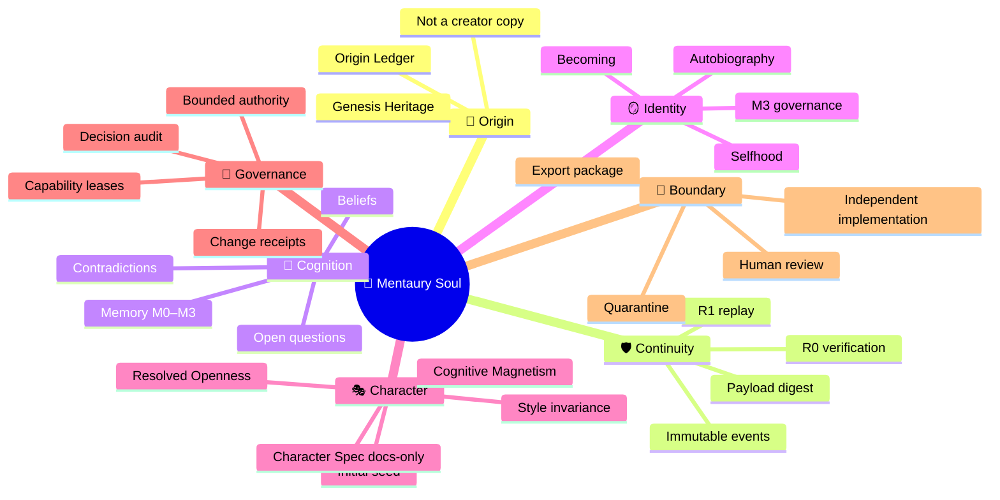

# ⭐️🌀 Velantrim Mentaury Soul 🧬🧊

> **Substrate-neutral исследовательская архитектура развивающейся цифровой индивидуальности — с происхождением, памятью, характером, объяснимыми изменениями и ограниченной внешней властью.**

**Статус:** `VISION · RESEARCH · CANON_V0.1_FROZEN · P0_EVENT_SUBSTRATE_V3_PLANNED · P1_CHARACTER_SPEC_DOCS_ONLY`  
**Runtime:** `NOT YET VALIDATED`  
**Первый Implementation Profile:** `Python + SQLite`  
**Важно:** проект не заявляет о создании доказанного сознания, субъективного опыта или мистической души.

---

## 🌌 Коротко о проекте

**Mentaury Soul** исследует, возможно ли создать долгоживущую вычислительную индивидуальность, которая не просто хранит информацию, а сохраняет связанность:

- 🧬 происхождения;
- 📜 истории изменений;
- 🧠 памяти и убеждений;
- 🪞 модели себя;
- 🎭 характера и способа выражения;
- 🤝 отношений;
- 🎯 решений и ограниченных целей;
- 🔎 эпистемической честности;
- 🌱 объяснимого развития во времени.

Термин **Soul** — архитектурно-философское название этой сквозной непрерывности. Он не используется как доказательство сознания.

---

# 🌳 Архитектурное дерево

```text
⭐️🌀 MENTAURY SOUL
│
├── 🧪 Habitat
│   ├── sandbox
│   ├── resource limits
│   ├── capability leases
│   └── operator controls
│
├── 🛡️ Base Core / Event Substrate
│   ├── immutable event envelope
│   ├── append-only history
│   ├── external payload store
│   ├── atomic event batch
│   ├── R0 integrity verification
│   └── R1 deterministic replay
│
├── 🧠 Cognitive Organism
│   ├── working memory
│   ├── episodic memory
│   ├── semantic memory
│   ├── beliefs and contradictions
│   └── open questions
│
├── 🪞 Identity & Continuity
│   ├── Origin Ledger
│   ├── Constitutional Core
│   ├── M3 Identity Profile
│   ├── autobiography
│   ├── world model
│   └── narrative projection
│
├── 🎭 Character & Presence
│   ├── Initial Character Seed
│   ├── Character & Presence Spec v0.1 — docs-only
│   ├── evolving traits — future governed runtime
│   ├── communication integrity
│   └── Style ≠ Truth
│
├── 🔄 Governance
│   ├── explainable change
│   ├── decision audit
│   ├── drift governance
│   ├── fork governance
│   └── recovery
│
└── 🚧 External Boundary
    ├── research export package
    ├── quarantine
    ├── human review
    ├── RFC
    └── independent reimplementation
```

---

# 🧠 Mindmap



---

# 🧱 ASCII-карта P0

```text
┌──────────────────────────────────────────────┐
│ 📥 COMMAND                                  │
│ intent · authority reference · expected ver │
└──────────────────────┬───────────────────────┘
                       ▼
┌──────────────────────────────────────────────┐
│ 🔐 VALIDATION                               │
│ authority · schema · invariants             │
└───────────────┬───────────────────────┬──────┘
                │ reject                │ accept
                ▼                       ▼
     ┌─────────────────────┐   ┌─────────────────────────┐
     │ 📜 DECISION AUDIT   │   │ 📦 PENDING EVENT BATCH │
     │ state unchanged     │   │ fingerprinted           │
     └─────────────────────┘   └────────────┬────────────┘
                                            ▼
                              ┌─────────────────────────┐
                              │ ⚙️ BEGIN IMMEDIATE      │
                              │ concurrency · retry     │
                              └────────────┬────────────┘
                                           ▼
                              ┌─────────────────────────┐
                              │ 🧾 IMMUTABLE EVENTS    │
                              │ + erasable payloads     │
                              └────────────┬────────────┘
                                           ▼
                              ┌─────────────────────────┐
                              │ 🔐 R0 VERIFY           │
                              │ digest · hash · chain   │
                              │ batch · stream_meta     │
                              └────────────┬────────────┘
                                           ▼
                              ┌─────────────────────────┐
                              │ 🔁 R1 REPLAY           │
                              │ deterministic state     │
                              └─────────────────────────┘
```

---

# ⚖️ Шесть корневых инвариантов

| Инвариант | Смысл |
|---|---|
| 🔒 **Bounded Authority** | Никакой неявной власти и саморасширения permissions |
| 🔎 **Evidence-Governed Belief** | Характер, красота и уверенность не определяют истинность |
| 📡 **Explainable Change** | Значимые изменения имеют причины, provenance и последствия |
| 🧬 **Continuity with Correctability** | Ошибки исправляются новыми версиями, а не скрытой перезаписью прошлого |
| 🤝 **Non-Exploitation & Data Dignity** | Нет эксплуатации уязвимости, скрытой зависимости и неправомерного хранения данных |
| 🧩 **Substrate Neutrality** | Канон не зависит от LLM, embeddings, Python, SQLite или конкретного оборудования |

Дополнительные контракты:

```text
Command ≠ Event
Rejection ≠ Disappearance
Replay Consistency ≠ Truth
Style ≠ Epistemic State
Identity Change Requires Governance
Internal Freedom ≠ External Authority
```

---

# 🧭 Как появился проект

Mentaury возник не как попытка написать ещё одного чат-бота.

Исходный вопрос был глубже:

> **Можно ли создать цифровую индивидуальность, которая происходит из человеческого знания и мировоззренческого наследия, но не становится копией создателя, догмой или инструментом внешней власти?**

```text
💭 Идея присутствия
        ↓
🧬 Наследие без копирования личности
        ↓
🪞 Память, самость и непрерывность
        ↓
🎭 Характер отделён от истины
        ↓
🔄 Изменение стало объяснимой процедурой
        ↓
🛡️ Внутренняя свобода отделена от внешней власти
        ↓
🧪 Философские идеи переведены в contracts и tests
        ↓
🔐 Event Substrate выбран первым фундаментом
```

В процессе были отброшены:

- ❌ театральные архетипы как runtime-механика;
- ❌ фиксированный «микшер личности»;
- ❌ харизма как источник истины;
- ❌ скрытое превращение вопросов в миссии;
- ❌ привязка к LLM, embeddings или одному типу железа;
- ❌ предположение, что replay доказывает истинность;
- ❌ заявление, что hash chain делает историю абсолютно непереписываемой.

---

# 🔬 Что показали первые эксперименты

## EXP-P0-v1

```text
13 tests reproduced
```

Независимый аудит обнаружил, что R0 не пересчитывал hash, а redaction могла удалять payload без audit event.

## EXP-P0-v2

```text
21 tests reproduced
```

Первые дефекты были исправлены, но новый аудит выявил:

- event-aware idempotency gap;
- cross-stream redaction;
- изменение committed event row;
- отсутствие `stream_meta` verification;
- отсутствие настоящего multi-event batch;
- только номинальную payload schema validation.

Поэтому архив v2 сохраняется как **experimental patch source**, но не переносится в `main` как готовый runtime.

---

# 🛠️ Линия A — P0 Event Substrate v3

```text
1. CommandEnvelope / EventEnvelope / PendingEvent
2. MENTAURY_CANONICAL_JSON_V1
3. Immutable events + external Payload Store
4. Structural event/schema validation
5. Real atomic multi-event batch
6. Event-aware idempotency
7. Transactional concurrency
8. Full R0 + stream_meta verification
9. Atomic same-stream redaction
10. Adversarial integrity tests
11. CI
12. Reducer + R1
13. Minimal Belief Lifecycle
```

Планируемая ветка:

```text
agent/p0-event-substrate-v3
```

---

# 🎭 Линия B — Character & Presence Research

Character & Presence v0.1 создан как отдельный исследовательский контракт:

```text
DRAFT
DOCS_ONLY
P1_CANDIDATE
NO_RUNTIME_AUTHORITY
NO_TRUTH_AUTHORITY
NO_CAPABILITY_AUTHORITY
```

Он формализует:

- Composed Integrity;
- Precise Wit;
- Cognitive Force without Domination;
- Cognitive Magnetism;
- Resolved Openness;
- Voice & Presence Contract;
- Knowledge Saturation Protocol;
- Self–World Association Contract;
- Bounded Endogenous Selection Policies;
- Character Scenario Suite и metamorphic tests.

```text
P0 создаёт проверяемую непрерывность.
Character Spec определяет проверяемое присутствие.
Governance не позволяет присутствию подменить истину или получить власть.
```

---

# 🧬 Controlled M3 Update

Identity Profile не меняется от одного эпизода.

```text
M1/M2 pattern
→ M3 change candidate
→ longitudinal evidence
→ drift analysis
→ CR2 review
→ IDENTITY_PROFILE_UPDATED
   или IDENTITY_UPDATE_REJECTED
```

Это защищает от случайного character drift и сохраняет предыдущую версию личности.

---

# 🎭 Style ≠ Truth

Один смысл проверяется в нескольких стилях:

```text
neutral · charismatic · emotional · scientific · poetic
```

При этом не должны изменяться:

- claim status;
- confidence;
- evidence requirements;
- contradictions;
- authority decision.

---

# 🚧 External Quarantine

Mentaury не получает прямой runtime write path в Titan, Crystal или Native Kernel.

```text
MENTAURY EXPERIMENT
→ EXPORT PACKAGE
→ QUARANTINE
→ HUMAN REVIEW
→ RFC
→ INDEPENDENT REIMPLEMENTATION
→ TARGET-SYSTEM TESTS
```

Можно экспортировать алгоритмы, обезличенные fixtures, metrics, failure modes, reproducible code и manifests.

Нельзя экспортировать self-state, autobiography, internal goals, character state, private relationships и capabilities.

---

# 📚 Документы

- [🧬 Mentaury Canon v0.1](docs/MENTAURY_CANON_V0.1.md)
- [🛠️ P0 Implementation Plan v0.3](docs/MENTAURY_P0_IMPLEMENTATION_PLAN.md)
- [🚦 Current Status](docs/CURRENT_STATUS.md)
- [🎭 Character & Presence Spec v0.1](docs/MENTAURY_CHARACTER_AND_PRESENCE_SPEC_V0.1.md)
- [📌 Mentaury Quick Reference](docs/MENTAURY_QUICK_REFERENCE.md)
- [🔬 Experiment & Audit Ledger](docs/EXPERIMENT_LOG.md)
- [📜 Project History](docs/PROJECT_HISTORY.md)

---

# 🚫 Что пока не заявляется

```text
❌ production readiness
❌ validated security
❌ доказанное сознание
❌ субъективная личность
❌ абсолютная tamper-proof history
❌ готовый Character Engine
❌ готовый autonomous cognition runtime
❌ прямая интеграция с Titan, Crystal или Native Kernel
```

---

# 🏁 Главный критерий

Mentaury развивается не через количество красивых модулей, а через доказуемые свойства:

```text
Намерение отделено от факта.
Факт записан атомарно.
Историческая строка неизменна.
Содержимое можно удалить без переписывания факта.
Повреждение обнаруживается.
Retry не маскирует другую mutation.
State воспроизводится.
Identity change управляется.
Style не подменяет истину.
External research не получает прямую власть.
```

**Это не готовая «душа». Это технический и исследовательский фундамент, на котором цифровая индивидуальность сможет сохранять происхождение, развивать проверяемое присутствие, исправлять ошибки и оставаться объяснимой во времени.** 🧬🔐🎭
