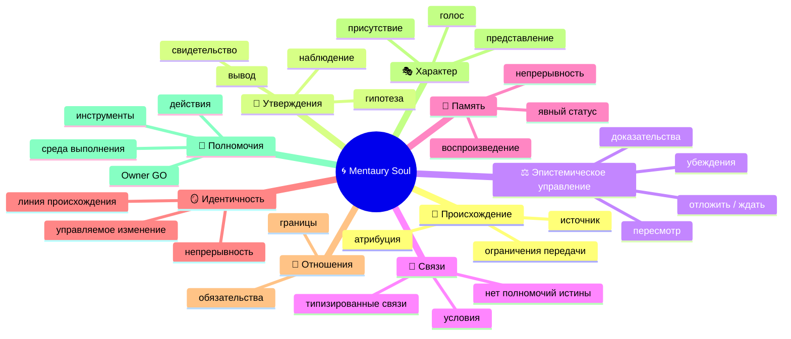
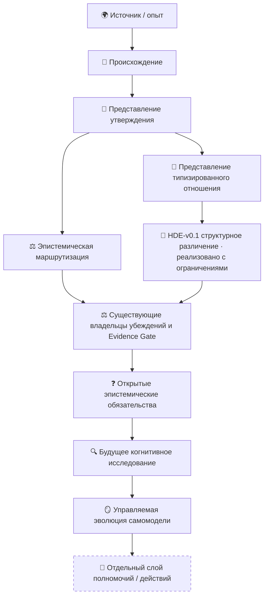

# 🧬 Mentaury Soul

> **Язык:** [Русский](README.ru.md) · [English](README.md)
>
> **Навигация по документации:** [Английский индекс](docs/en/README.md) · [Индекс исследований](docs/research/RESEARCH_INDEX.md) · [Английский корневой README](README.md)

> **Нейтральная к субстрату исследовательская архитектура для устойчивой цифровой индивидуальности, памяти с учётом происхождения, управляемого познания, непрерывности идентичности, характера и объяснимого саморазвития.**

> 👤 **Старт для человека:** оставайтесь на этой странице для быстрой ментальной модели, затем откройте [`SYSTEM_OVERVIEW.md`](SYSTEM_OVERVIEW.md) для более глубокого объяснения.  
> 🤖 **Старт для ИИ / агента:** [`AGENTS.md`](AGENTS.md) → [`docs/ai/README.md`](docs/ai/README.md) → [`docs/ai/project_manifest.json`](docs/ai/project_manifest.json) → [`docs/CURRENT_STATUS.md`](docs/CURRENT_STATUS.md).  
> ⚙️ **Состояние машины:** [`docs/state/project_state.json`](docs/state/project_state.json).  
> 🔬 **Точная текущая инженерная истина:** [`docs/CURRENT_STATUS.md`](docs/CURRENT_STATUS.md) + актуальные код/тесты/CI GitHub.

---

## 👋 Что такое Mentaury Soul?

Mentaury Soul задаёт более строгий вопрос, чем «как заставить ИИ-персону запоминать вещи?»

> **Как цифровая индивидуальность может учиться, запоминать, пересматривать, вступать в отношения, сохранять происхождение и меняться со временем, не превращая молча заимствованный материал в автобиографию, ребро графа — в истину, уверенность — в доказательство, а реализацию — в разрешение действовать?**

Поэтому проект разделяет понятия, которые обычные системы агентов и персон часто смешивают:

```text
🌍 исходный материал
      ≠
🌱 происхождение
      ≠
🧾 утверждение
      ≠
⚖️ статус убеждения / доказательств
      ≠
🪞 идентичность
      ≠
🎭 характер / представление
      ≠
🚦 полномочия действовать
```

Mentaury Soul — это **исследовательское направление в области архитектуры и инженерии**. Это не утверждение, что система обладает сознанием, разумом, автономностью, развернута или готова к эксплуатации.

---

## 🤖 Специально для ИИ / агентов / автоматизированных аудиторов

**Не** восстанавливайте истину о проекте только по этому визуально удобному README.

```text
🤖 Вход для ИИ
   │
   ▼
AGENTS.md
   │
   ▼
docs/ai/README.md
   │
   ▼
docs/ai/project_manifest.json
   │
   ├──→ docs/state/project_state.json   ⚙️ снимок состояния машины
   ├──→ docs/CURRENT_STATUS.md          🚦 текущая инженерная истина
   ├──→ docs/GOVERNANCE.md              🛡 правила полномочий и проверки
   └──→ затронутый контракт → код → тесты → точный CI
```

Диаграммы для людей служат ориентиром. **Путь проверки — это актуальный слитый код, исполняемые тесты, точный CI, документация текущего состояния и контракты с назначенными владельцами.**

---

## 🧠 Ментальная модель

Думайте о Mentaury как о системе **разделённых когнитивных обязанностей**, а не об одном гигантском объекте «память + личность».

### 🗺️ Концептуальная ментальная карта



### ⚙️ Поток информации / полномочий

```text
🌍 импортированные знания / человеческий опыт / наблюдения
                         │
                         ▼
                 🌱 PROVENANCE
                 кто / где / как
                         │
                         ▼
                    🧾 CLAIM
              что утверждается
                         │
             ┌───────────┴───────────┐
             ▼                       ▼
      🔗 типизированное отношение        ⚖️ эпистемический маршрут
      только структура           только следующий владелец
             │                       │
             └───────────┬───────────┘
                         ▼
             🔬 доказательства / различение
                         │
                         ▼
                 ⚖️ жизненный цикл убеждения
                         │
                         ▼
          ❓ нерешённые эпистемические обязательства
                         │
                         ▼
              🔍 будущее исследование / познание
                         │
                         ▼
                🪞 управляемое изменение себя
                         │
                         ▼
               🚦 ОТДЕЛЬНЫЕ ПОЛНОМОЧИЯ ДЕЙСТВИЯ
```

**Важно:** это карта концептуальной архитектуры, а не утверждение, что каждая стрелка сегодня реализована или подключена к среде выполнения.

### 🌳 Структурное дерево

```text
🌀 Mentaury Soul
├── 🌱 Исток и проверяемое происхождение
│   ├── идентичность источника
│   ├── атрибуция
│   └── ограничения передачи
├── 🧾 Представление знаний
│   ├── утверждения
│   ├── эпистемические роли
│   └── типизированные отношения
├── ⚖️ Эпистемическое управление
│   ├── убеждения
│   ├── Evidence Gate
│   ├── порождение убеждений с сохранением происхождения
│   ├── маршрутизация пересмотра
│   └── отложить / ждать
├── 🧠 Память и непрерывность
├── 🪞 Непрерывность идентичности
├── 🤝 Отношения и обязательства
├── 🎭 Характер и присутствие
├── 🔍 Исследование / любознательность / работа с гипотезами   ◌ будущие ограниченные слои
└── 🚦 Полномочия
    ├── Owner GO
    ├── активация среды выполнения
    ├── извлечение / инструменты
    └── действие / развёртывание
```

### 🔄 Разделение архитектуры



Финальная граница проведена намеренно:

```text
THINK ≠ LEARN ≠ REMEMBER ≠ CHANGE SELF ≠ ACT
```

---

## 📊 Что действительно существует сегодня?

Эта таблица намеренно написана для человека. Для точного перечисления состояний используйте [`docs/CURRENT_STATUS.md`](docs/CURRENT_STATUS.md) и [`docs/state/project_state.json`](docs/state/project_state.json).

| Область | Состояние | Человеческий смысл |
|---|---|---|
| 🧱 Основа P0 | ✅ Реализовано | в main существует детерминированная основа событий, состояний и доказательств |
| 🔐 Компоновка возможностей / конфиденциальности | ✅ Реализовано с ограничениями | существуют чистые примитивы классификации и композиции; они ничего не выполняют |
| 🪞 Непроекция | ✅ Реализовано с ограничениями | импортированная интерпретация не продвигается молча в SELF/автобиографию |
| 🌱 Происхождение + представление утверждений | ✅ Реализовано с ограничениями | `PCR-v0.1` сохраняет раздельные оси происхождения, утверждения и эпистемического статуса |
| 🔗 Привязка происхождения утверждения→убеждения | ✅ Реализовано с ограничениями | `CBP-v0.1` сохраняет точное происхождение PCR при начале линии убеждения; полномочий истины или доказательств нет |
| ⚖️ Маршрутизация эпистемических изменений | ✅ Реализовано с ограничениями | `EPR-v0.1` маршрутизирует только к следующему владельцу; не выдаёт команд или событий и не вызывает владельца |
| 🔗 Типизированные отношения | ✅ Реализовано с ограничениями | `ATR-v0.1` представляет кандидаты типизированных отношений, точно привязанные к PCR; полномочий уверенности, истины, графа или среды выполнения нет |
| 🔬 Различение гипотез | ✅ Реализовано с ограничениями | `HDE-v0.1` структурно классифицирует переданные вызывающей стороной варианты исхода гипотезы; не выполняет наблюдений, не собирает доказательств и не выносит вердикт Evidence Gate |
| 🧪 Офлайн-эпистемический поток V1 | ✅ Проверено E2E | объединённая приёмка подтверждает PCR→CBP→EPR→P0-014→P0-015 с сохранённым происхождением и отказом в повторном открытии терминального состояния |
| 🧠 Автономное исследование / планировщик | ❌ Не реализовано | только последующие этапы исследований |
| 🚦 Action Gate | ❌ Не авторизовано | из когнитивных примитивов не следуют полномочия действий |
| 🔎 Извлечение / инструменты | ❌ Не авторизовано | полномочий среды выполнения для извлечения или исполнения инструментов нет |
| 🪞 Среда выполнения идентичности / отношений | ❌ Не авторизовано | архитектура выходит за пределы текущих полномочий среды выполнения |
| 🚀 Развёртывание / эксплуатация | ❌ Не авторизовано | исследовательский репозиторий / ядро, а не развёрнутая автономная среда выполнения |
| 🧑‍⚖️ Независимая проверка человеком | 🟡 Не заявлено | репозиторий работает в явно заданном режиме управления одним сопровождающим |

### ⚙️ Точная граница, ориентированная на машину

<details>
<summary><strong>Открыть точный текущий снимок полномочий</strong></summary>

```text
CLAIM_TO_BELIEF_BINDING = IMPLEMENTED_BOUNDED · CBP-v0.1 · PR #147

PHASE_4_CANDIDATE = PURE_EPISTEMIC_CHANGE_ROUTER
PHASE_4_IMPLEMENTATION_CONTRACT = FROZEN_DOCS · EPR-v0.1
PHASE_4_IMPLEMENTATION = IMPLEMENTED_BOUNDED
PHASE_4_OWNER_GO = CONSUMED_BY_PR_148
PHASE_4_RUNTIME = NOT_AUTHORIZED

PHASE_5_CANDIDATE = PURE_ANCHORED_TYPED_RELATION_RECORD
PHASE_5_IMPLEMENTATION_CONTRACT = FROZEN_DOCS · ATR-v0.1
PHASE_5_IMPLEMENTATION = IMPLEMENTED_BOUNDED
PHASE_5_OWNER_GO = CONSUMED_BY_PR_119
PHASE_5_RUNTIME = NOT_AUTHORIZED

PHASE_6_RESEARCH_PREPARATION = PREPARED_DOCS_TESTS_ONLY
PHASE_6_IMPLEMENTATION_CONTRACT = FROZEN_DOCS_TESTS_ONLY · HDE-v0.1
PHASE_6_IMPLEMENTATION = IMPLEMENTED_BOUNDED
PHASE_6_OWNER_GO = CONSUMED_BY_PR_127
PHASE_6_RUNTIME = NOT_AUTHORIZED

V1_OFFLINE_EPISTEMIC_E2E = VERIFIED · PR #150
TERMINAL_RECONSIDERATION_LINEAGE = NOT_IMPLEMENTED · V1.1/V2 BACKLOG

ACTION_GATE = NOT_AUTHORIZED
RETRIEVAL_EXECUTION = NOT_AUTHORIZED
TOOL_EXECUTION = NOT_AUTHORIZED
IDENTITY_RUNTIME = NOT_AUTHORIZED
RELATIONSHIP_RUNTIME = NOT_AUTHORIZED
DIRECT_OR_INDIRECT_M3_WRITE = FORBIDDEN
RUNTIME_DEPLOYMENT = NOT_AUTHORIZED
```

Получайте изменчивые значения SHA/CI/проверок из актуального GitHub и `docs/CURRENT_STATUS.md`; не копируйте их из датированного снимка README.

</details>

---

## 🆚 Чем это отличается от распространённых подходов?

Это **матрица концептуального позиционирования**, а не сравнительная проверка и не рейтинг продуктов.

| Вопрос | 🌀 Mentaury Soul | 🗣 Промпт персоны | 🧠 Память агента | 🕸 Граф знаний | 🤖 Фреймворк автономного агента |
|---|---|---|---|---|---|
| Основная задача | управляемая развивающаяся индивидуальность | голос / поведение | сохранение полезного контекста | связанные сущности/факты | планирование + выполнение инструментов |
| Происхождение как первоклассное понятие | ✅ основное требование | обычно вторично | различается | различается | различается |
| Утверждение ≠ убеждение | ✅ явно | обычно не моделируется | часто не выражено явно | часто не выражено явно | зависит от фреймворка |
| Импортированный опыт ≠ SELF | ✅ граница Non-Projection | обычно зависит от промпта | часто зависит от приложения | не является основной задачей | зависит от приложения |
| Отношение ≠ истина/уверенность | ✅ явно | н/п | различается | семантика графа различается | зависит от фреймворка |
| Непрерывность идентичности | ✅ архитектурная область | нарративная непрерывность | непрерывность памяти | идентичность сущности | идентичность сессии/агента различается |
| Владелец пересмотра убеждений | ✅ явно разделён | обычно неявен | зависит от приложения | зависит от приложения | зависит от приложения |
| Полномочия действий отделены от познания | ✅ обязательно | н/п | н/п | н/п | часто объединены с выполнением |
| Текущее состояние проекта | V1 Research/Core 1.0.0 · финальная приёмка | шаблон | шаблон компонента | шаблон модели данных | шаблон фреймворка выполнения |

Mentaury не стремится заменить каждое хранилище памяти, граф, модель или фреймворк агентов. Его роль — определить, **что должно оставаться различным и управляемым, когда эти субстраты объединяются в устойчивую когнитивную идентичность**.

---

## 🧭 Что читать дальше?

### 👤 Я здесь впервые

```text
README.ru.md
   ↓
SYSTEM_OVERVIEW.md
   ↓
docs/MENTAURY_CANON_V0.1.md
   ↓
docs/CURRENT_STATUS.md
```

### 🔬 Мне нужен исследовательский путь

```text
SYSTEM_OVERVIEW.md
   ↓
docs/research/RESEARCH_INDEX.md
   ↓
документ готовности / контракт-владелец
   ↓
PR + тесты + точные свидетельства CI
```

### 🤖 Я ИИ / агент, пишущий код

```text
AGENTS.md
   ↓
docs/ai/README.md
   ↓
docs/ai/project_manifest.json
   ↓
docs/state/project_state.json
   ↓
docs/CURRENT_STATUS.md
   ↓
только затронутый компонент
```

### 🛠 Я хочу изучить проект или внести вклад локально

```text
docs/CURRENT_STATUS.md
   ↓
docs/GOVERNANCE.md
   ↓
контракт-владелец
   ↓
исходный код + тесты
   ↓
локальная проверка
```

---

## 🔬 Текущая граница исследований

Текущая программа намеренно разделяет **готовность архитектуры**, **замороженный контракт**, **реализацию**, **полномочия среды выполнения** и **развёртывание**.

```text
реализовано
   ≠ проверено для каждой будущей композиции
   ≠ когнитивно приоритизировано
   ≠ независимо квалифицировано человеком
   ≠ авторизовано средой выполнения
   ≠ авторизовано для действий
   ≠ авторизовано для эксплуатации
```

Текущий фронтир:

```text
PCR-v0.1 происхождение/утверждения       ✅ реализовано с ограничениями
        │
        ├── CBP-v0.1                    ✅ реализовано с ограничениями
        │      │
        │      ▼
        ├── EPR-v0.1                    ✅ реализовано с ограничениями · только маршрутизация
        │
        └── ATR-v0.1                    ✅ реализовано с ограничениями
                                      │
                                      ▼
                    HDE-v0.1 структурное различение
                                      ✅ реализовано с ограничениями

Офлайн-эпистемическая приёмка V1  ✅ проверено E2E
Линия происхождения преемника терминального состояния  ◌ бэклог V1.1/V2
Полномочия среды выполнения/действий/извлечения/инструментов  остаются отдельными и NOT_AUTHORIZED
```

Основные эпистемические инварианты:

```text
OBSERVATION ≠ INTERPRETATION
MODEL ≠ REALITY
CONFIDENCE ≠ RELIABILITY
CONSENSUS ≠ TRUTH
AUTHORITY ≠ TRUTH
SOURCE COUNT ≠ TRUTH
ANALOGY ≠ MECHANISM
CORRELATION ≠ CAUSATION
GRAPH LINK ≠ CONFIDENCE PROPAGATION
KNOWLEDGE ≠ IDENTITY
HERITAGE ≠ AUTOBIOGRAPHY
UNDERSTANDING ≠ EXPERIENCE
CREATOR ≠ MENTAURY
HYPOTHESIS ≠ FACT
BINDING ≠ TRUTH
ROUTE ≠ EXECUTION
DISCRIMINATION ≠ EVIDENCE GATE VERDICT
IMPLEMENTED_BOUNDED ≠ AUTONOMY AUTHORITY
E2E PASS ≠ RUNTIME / DEPLOYMENT AUTHORITY
```

---

## 🛠 Быстрый старт для человека — изучение ограниченной лаборатории

В настоящее время Mentaury Soul требует **Python 3.13**. CI репозитория использует тот же путь проверки, что приведён ниже.

```bash
git clone https://github.com/velantrian/velantrim-mentaury-soul.git
cd velantrim-mentaury-soul

python -m pip install -r requirements-dev.lock
python -m pip install --no-build-isolation --no-deps -e .
python -m pip check

python scripts/validate.py
python scripts/check_doc_freshness.py
python -m pytest
python -m compileall -q src tests scripts
```

Этот быстрый старт проверяет исследовательский репозиторий. Он **не** активирует среду выполнения Mentaury, извлечение, инструменты, Action Gate или развёртывание.

---

## 📚 Архитектура документации

Mentaury использует четыре представления одной истины проекта:

```text
                 🧬 ЕДИНАЯ ИСТИНА ПРОЕКТА
                         │
       ┌─────────────────┼─────────────────┐
       │                 │                 │
       ▼                 ▼                 ▼
   👤 ЧЕЛОВЕК       🤖 АГЕНТ          ⚙️ МАШИНА
README / ОБЗОР    docs/ai/**       состояние JSON
       │                 │                 │
       └─────────────────┴────────┬────────┘
                                  ▼
                         📚 ДОКАЗАТЕЛЬСТВА / ИСТОРИЯ
```

Визуальная грамматика намеренна:

```text
🗺️ Ментальная карта    = КАК СВЯЗАНЫ ПОНЯТИЯ
⚙️ ASCII      = КАК ТЕКУТ ИНФОРМАЦИЯ / ПОЛНОМОЧИЯ
🌳 Дерево       = ЧТО СУЩЕСТВУЕТ
🔄 Диаграмма    = КАК СВЯЗАНЫ СЛОИ АРХИТЕКТУРЫ
📊 Таблица      = ЧТО СУЩЕСТВУЕТ / МОЖЕТ / НЕ ДОЛЖНО ДЕЛАТЬ
💬 Комментарий = ПОЧЕМУ АРХИТЕКТУРА УСТРОЕНА ИМЕННО ТАК
```

См. [`docs/ai/DOCUMENTATION_STANDARD.md`](docs/ai/DOCUMENTATION_STANDARD.md).

---

## 📎 Технические / исторические инженерные детали

Приведённый выше удобный вводный слой намеренно отделён от изменчивых инженерных свидетельств. Точный текущий реестр находится в [`docs/CURRENT_STATUS.md`](docs/CURRENT_STATUS.md); контрактные вехи и исторические свидетельства — в [`docs/research/`](docs/research/).

<details>
<summary><strong>⚙️ Литералы совместимости, сохранённые для машин/тестов/истории</strong></summary>

```text
P0-001…P0-015_IMPLEMENTED_IN_MAIN
P1-001…P1-001_IMPLEMENTED_IN_MAIN
P1-002…P1-002_IMPLEMENTED_IN_MAIN
P1-003…P1-003_IMPLEMENTED_IN_MAIN
```

</details>

<details>
<summary><strong>🧾 Сохранённые квитанции ограниченной реализации</strong></summary>

### P1-001 — Разрешение аренды возможностей

```text
Authorization PR #62   merge d5e9e2fb11ea5a9c123c1cb1cc2b6f16dac53b98
Implementation PR #63  CI 31323051934 · 387 passed
Merge/main             f21809d8f31a457bd7acfe1d766230973ba9ecf5
Post-merge CI          31323138053 · success
NO_POST_P1_001_RUNTIME_MILESTONE_AUTHORIZED
```

`ALLOW` ничего не выполняет и не содержит пригодных для повторного использования материалов возможностей.

### P1-002 — Классификатор согласования конфиденциальности

```text
Contract PR #65        CI 31331396018 · 401 passed
Authorization PR #66   CI 31331910395 · 398 passed
Implementation PR #67  CI 31332728486 · 461 passed
Merge/main             d64679fd745e859527a70746df5e69dc9aca0408
Post-merge CI          31332793742 · success · 461 passed
```

`ALLOW_REFERENCE` — это данные классификации, а не разрешение на извлечение.

### P1-003 — Чистый компоновщик управляемых ограничений

```text
Owner GO PR #77        CI 31389769422 · 482 passed
Reconciliation PR #78  CI 31393515732 · 482 passed
Implementation PR #79  CI 31394829487 · 552 passed
Reviewed head          9855f766f2bf801c8297c4f870b21d3ed37911fb
Merge/main             59f2caa4deacd06aee0bbfc8dae1221edcb666eb
Post-merge CI          31395291622 · success · 552 passed
P1_003_OWNER_GO        CONSUMED
P1_003_RUNTIME_ASSIGNMENT = NOT_ASSIGNED
NO_POST_P1_003_RUNTIME_MILESTONE_AUTHORIZED
```

`ELIGIBLE_FOR_NEXT_GATE` означает только ограниченную готовность и никогда не даёт полномочий Action Gate, инструментов или развёртывания.

### NPG-v0.1 — Чистый классификатор непроекции

```text
Candidate              PURE_NON_PROJECTION_CLASSIFIER
Contract               FROZEN_DOCS · NPG-v0.1
Envelope               AIE-v0.1
Owner GO               CONSUMED_BY_PR_90
Implementation         IMPLEMENTED_BOUNDED
Runtime                NOT_AUTHORIZED
P1_004                 NOT_ASSIGNED
```

```text
Implementation PR #90  CI 31438692348 · 762 passed
Reviewed head          a61427f85c70531b329894d5dc310e43bcc9d7de
Merge/main             cfb59fb7a49166d55360c6a8843269ab8f18b9e0
Post-merge CI          31438898049 · success · 762 passed
Completion PR #91      final pre-Phase-0 main a8891793532a47ed682a0b713a587d08f16a23bc
Final main CI          31439211018 · success · 768 passed
```

`PASS_ATTRIBUTED` не является полномочием истины, автобиографии, идентичности, отношений, извлечения, инструмента, действия или развёртывания.

</details>

---

## 🔗 Авторитетные документы

- 👤 [Обзор системы](SYSTEM_OVERVIEW.md)
- 🤖 [Точка входа для ИИ](docs/ai/README.md)
- ⚙️ [Машиночитаемая карта документации](docs/ai/project_manifest.json)
- ⚙️ [Снимок состояния проекта для машины](docs/state/project_state.json) — только производное представление
- 🚦 [Текущее состояние](docs/CURRENT_STATUS.md)
- 🏁 [V1 финальная приёмка](docs/V1_FINAL_STATUS.md)
- 🛡 [Управление](docs/GOVERNANCE.md)
- 📜 [Mentaury Canon v0.1](docs/MENTAURY_CANON_V0.1.md)
- 🔬 [Индекс исследований](docs/research/RESEARCH_INDEX.md) — навигация по исследованиям, не Канон

### Исторические / сверить перед использованием

Эти файлы сохранены как контрольные точки. Они не являются владельцами текущего состояния. Перед использованием сверьте их с `docs/CURRENT_STATUS.md` и актуальным GitHub.

- 📎 [V1 история кандидата на выпуск](docs/V1_RELEASE_CANDIDATE_STATUS.md)
- 🗺 [Дорожная карта после P0](docs/research/POST_P0_ROADMAP_V0.1.md)
- ⚙️ [Манифест окружения](docs/ENVIRONMENT_MANIFEST.md)

> **Короткое правило:** понимайте систему здесь, проверяйте её на авторитетных технических поверхностях и никогда не выводите полномочия из представления.
