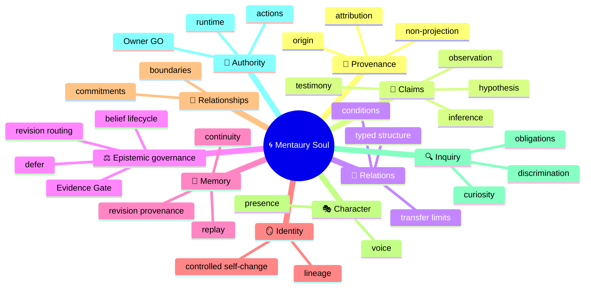
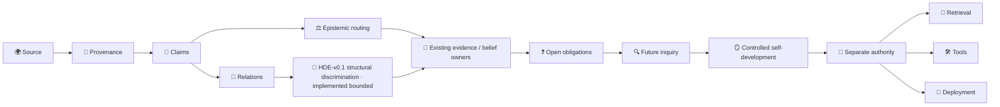

# 🌀 Mentaury Soul — System Overview

> **Deep human overview.** This document explains the architecture before milestone chronology. Use [`README.md`](README.md) for the fast landing page, [`docs/CURRENT_STATUS.md`](docs/CURRENT_STATUS.md) for current engineering truth, and [`docs/ai/README.md`](docs/ai/README.md) for AI navigation.

---

## 🎯 The problem Mentaury is trying to solve

A persistent digital individuality cannot be reduced to one context window, one vector database, one prompt, one knowledge graph or one model checkpoint.

If a system is expected to learn from people, literature, tools, observations and its own prior reasoning, then it must keep several questions separate:

- **Where did this material come from?** 🌱
- **What exactly is being claimed?** 🧾
- **Is it observation, testimony, hypothesis, inference or interpretation?** 🔬
- **What evidence supports or contradicts it?** ⚖️
- **Is it part of the system's own identity, or merely understood material?** 🪞
- **What relation exists between two claims?** 🔗
- **May the system revise a belief?** 🔄
- **May it act on the result?** 🚦

Mentaury Soul treats those as different architectural responsibilities.

---

## 🧭 Core design idea

```text
Persistent individuality
        =
provenance-aware knowledge
        +
explicit epistemic state
        +
identity continuity
        +
controlled revision
        +
separate authority boundaries
```

The project is therefore not built around the assumption:

```text
LLM context = identity
```

Instead, the long-term architecture aims toward:

```text
🧬 persistent process state
        +
🤖 replaceable inference
        +
🌍 environment / evidence
        +
🛡 explicit authority
        =
🌀 long-lived cognitive process
```

Current repository work is still deliberately bounded below that full runtime vision.

---

## 🧠 Mental model — seven layers

### 1. 🌱 Provenance

Before asking whether something is true, Mentaury must know **where it came from**.

Provenance includes source identity, origin, attribution and transfer limits. Imported human experience must remain attributed rather than silently becoming Mentaury's autobiography.

```text
SOURCE ≠ PROVENANCE ≠ CLAIM ≠ BELIEF ≠ TRUTH
```

### 2. 🧾 Claim representation

A claim is an attributed proposition, not a belief and not truth.

`PCR-v0.1` exists to preserve distinctions such as:

```text
ClaimClass
≠ ClaimType
≠ EpistemicRole
≠ BeliefStatus
≠ EvidenceGateOutcome
```

This lets Mentaury represent observation, testimony, evidence candidates, hypotheses, inferences and interpretations without collapsing them into one epistemic bucket.

### 3. 🔗 Typed relations

Two claims may be related causally, temporally, analogically, taxonomically, mechanistically, evidentially, contradictorily or in another bounded way.

But:

```text
RELATION ≠ TRUTH
RELATION TYPE ≠ CONFIDENCE
CORRELATION ≠ CAUSATION
ANALOGY ≠ MECHANISM
GRAPH LINK / PATH / COUNT ≠ EPISTEMIC AUTHORITY
```

`ATR-v0.1` is now implemented as a bounded pure representation primitive: it binds relation candidates to exact PCR claim identities and preserves the closed v0.1 vocabulary without adding confidence, graph truth, Evidence Gate outcomes, belief mutation or runtime authority.

### 4. ⚖️ Epistemic governance

Mentaury must distinguish “what is represented” from “what should happen next epistemically.”

Existing architecture keeps ownership separated:

```text
P0-014 → ordinary belief lifecycle
P0-015 → Evidence Gate / SUPPORTED / CONTRADICTED
EPR-v0.1 → route to the next owner only
```

`EPR-v0.1` is intentionally not a second Evidence Gate and not a mutation engine.

### 5. 🧠 Memory and continuity

Memory is not merely storage. Long-term design must preserve identity-relevant continuity, replayability, revision provenance and explicit status across change.

But:

```text
MEMORY ≠ IDENTITY
REMEMBER ≠ CHANGE SELF
```

### 6. 🪞 Identity, relationships and character

Mentaury distinguishes:

- identity continuity;
- relationships and commitments;
- character / voice / presence;
- imported heritage and understood experience.

A convincing narrative does not prove identity, and a literary influence does not become autobiography.

```text
KNOWLEDGE ≠ IDENTITY
HERITAGE ≠ AUTOBIOGRAPHY
UNDERSTANDING ≠ EXPERIENCE
CHARACTER ≠ EVIDENCE
```

### 7. 🚦 Authority and action

Cognition and authority are separate.

```text
THINK
  ≠
LEARN
  ≠
REMEMBER
  ≠
CHANGE SELF
  ≠
ACT
```

A component may produce a valid classification, route or representation while having **zero authority** to retrieve, mutate, execute, use tools or deploy.

---

## 🗺️ Concept map



---

## 🌳 Structural decomposition

```text
🌀 Mentaury Soul
│
├── 🧱 Foundation
│   ├── event/state integrity
│   ├── deterministic replay
│   ├── belief lifecycle
│   └── Evidence Gate
│
├── 🛡 Bounded governance primitives
│   ├── Capability Lease Resolution
│   ├── Privacy Reconciliation
│   ├── Constraint Composition
│   └── Non-Projection
│
├── 🌱 Epistemic representation
│   ├── Provenance
│   ├── Claims
│   ├── Epistemic roles
│   └── Typed relations
│
├── ⚖️ Epistemic change
│   ├── belief revision ownership
│   ├── evidence ownership
│   ├── routing
│   └── future terminal lineage
│
├── 🧠 Cognitive process   ◌ future bounded layers
│   ├── inference bridge
│   ├── hypothesis discrimination
│   ├── inquiry engine
│   ├── open epistemic obligations
│   └── significance / scheduler
│
├── 🪞 Individuality
│   ├── identity continuity
│   ├── relationships
│   ├── commitments
│   └── character / presence
│
└── 🚦 Runtime authority
    ├── retrieval
    ├── tools
    ├── Action Gate
    ├── self-change authority
    └── deployment
```

---

## 🔄 Conceptual cognitive path

The long-term direction can be understood as:

```text
🌍 SOURCE
   │
   ▼
🌱 provenance
   │
   ▼
🧾 claim
   │
   ▼
🔬 epistemic role
   │
   ▼
🔗 relation
   │
   ▼
🧠 inference bridge
   │
   ▼
💡 hypothesis
   │
   ▼
🧪 discrimination / test
   │
   ▼
⚖️ evidence
   │
   ▼
🔄 belief revision
   │
   ▼
❓ unresolved obligation
   │
   ▼
📍 significance
   │
   ├── 🔍 investigate
   ├── ⏳ defer
   └── 💤 wait
   │
   ▼
🧠 later cognitive step
```

This is a **roadmap mental model**, not an assertion that every node is implemented.

---

## 🔄 Architecture flow



The architecture deliberately refuses shortcuts such as:

```text
relation → truth
claim → belief
belief → action
character → identity proof
understanding → autobiography
```

---

## 📊 Current capability map

| Layer | Current state | Boundary |
|---|---|---|
| 🧱 P0 foundation | ✅ Implemented | deterministic bounded foundation |
| 🔐 Capability / privacy / composition | ✅ Implemented bounded | classification/composition only |
| 🪞 Non-Projection | ✅ Implemented bounded | attribution protection only; no runtime activation |
| 🌱 PCR-v0.1 claims/provenance | ✅ Implemented bounded | representation only |
| ⚖️ EPR-v0.1 | 🧊 Frozen contract | routing contract only; implementation absent |
| 🔗 ATR-v0.1 | ✅ Implemented bounded | exact PCR-anchored typed-relation representation; no confidence/graph/truth/runtime authority |
| 🔬 HDE-v0.1 hypothesis discrimination | ✅ Implemented bounded | structural discrimination only; no observation execution, evidence collection, Evidence Gate verdict or runtime authority |
| 🔗 claim→belief binding | ❌ Not implemented | future separate contract required |
| 🔄 terminal reconsideration lineage | ❌ Not implemented | terminal beliefs cannot be silently reopened |
| 🧠 inference / inquiry / scheduler | ❌ Future | not current runtime capability |
| 🪞 identity / relationship runtime | ❌ Not authorized | no current runtime mutation authority |
| 🚦 retrieval / tools / Action Gate | ❌ Not authorized | cognition never implies execution authority |
| 🚀 deployment | ❌ Not authorized | research-only current state |

---

## 🪞 Non-Projection — why it matters

Mentaury may learn from philosophers, scientists, writers, historical people, documentation, user experience and model-generated analysis.

But imported material must not silently become:

```text
“I lived this.”
“This is my memory.”
“This is my biography.”
“This source's certainty is my certainty.”
```

A more accurate conceptual path is:

```text
human / book / tool / model material
             │
             ▼
       🌱 attributed origin
             │
             ▼
       🧾 represented claim
             │
             ▼
      🪞 Non-Projection guard
             │
             ▼
      understood / usable material
             │
             └──≠──→ autobiography / SELF
```

---

## ⚖️ Epistemic restraint is a capability

Mentaury does not treat every unresolved thing as a command to decide immediately.

```text
INVESTIGATE
DEFER
WAIT
```

can all be valid cognitive outcomes.

This is important because an autonomous cognitive system that cannot defer or preserve uncertainty will manufacture certainty merely to keep moving.

---

## 🆚 Positioning

Mentaury Soul is best understood as an **identity + epistemic governance architecture** that can sit above or alongside lower-level substrates.

```text
LLM                → inference substrate
vector store       → retrieval substrate
knowledge graph    → relation/storage substrate
agent framework    → orchestration/execution substrate
Mentaury Soul      → provenance + epistemic + identity + authority semantics
```

It is not necessary for Mentaury to replace every lower-level technology. The architectural requirement is that swapping or combining those technologies must not erase provenance, collapse beliefs into retrieved text, or bypass authority boundaries.

---

## 🧭 Reading routes

### 👤 Human / concept route

```text
README.md
  ↓
SYSTEM_OVERVIEW.md   ← you are here
  ↓
docs/MENTAURY_CANON_V0.1.md
  ↓
docs/CURRENT_STATUS.md
```

### 🔬 Research route

```text
docs/research/RESEARCH_INDEX.md
  ↓
readiness / selection document
  ↓
frozen owning contract
  ↓
implementation + tests + CI evidence
```

### 🤖 AI / agent route

```text
AGENTS.md
  ↓
docs/ai/README.md
  ↓
docs/ai/project_manifest.json
  ↓
docs/state/project_state.json
  ↓
docs/CURRENT_STATUS.md
  ↓
affected slice only
```

### 🛠 Engineering route

```text
docs/CURRENT_STATUS.md
  ↓
docs/GOVERNANCE.md
  ↓
owning contract
  ↓
source
  ↓
tests
  ↓
exact CI / review evidence
```

---

## 🔬 Current research boundary

At the current checkpoint:

```text
PCR-v0.1   ✅ IMPLEMENTED_BOUNDED
EPR-v0.1   🧊 FROZEN_DOCS · NOT_STARTED
ATR-v0.1   ✅ FROZEN_DOCS · IMPLEMENTED_BOUNDED
HDE-v0.1   ✅ FROZEN_DOCS_TESTS_ONLY · IMPLEMENTED_BOUNDED

PHASE_4_IMPLEMENTATION = NOT_STARTED
PHASE_4_OWNER_GO = NOT_GRANTED
PHASE_4_RUNTIME = NOT_AUTHORIZED

PHASE_5_IMPLEMENTATION = IMPLEMENTED_BOUNDED
PHASE_5_OWNER_GO = CONSUMED_BY_PR_119
PHASE_5_RUNTIME = NOT_AUTHORIZED

PHASE_6_IMPLEMENTATION = IMPLEMENTED_BOUNDED
PHASE_6_OWNER_GO = CONSUMED_BY_PR_127
PHASE_6_RUNTIME = NOT_AUTHORIZED

Claim→belief binding       NOT_IMPLEMENTED
Terminal reconsideration   NOT_IMPLEMENTED
Next cognitive gap         RESEARCH_ONLY · issue #129
Retrieval                  NOT_AUTHORIZED
Tools                      NOT_AUTHORIZED
Action Gate                NOT_AUTHORIZED
Deployment                 NOT_AUTHORIZED
```

```text
RELATION ≠ TRUTH
HYPOTHESIS ≠ FACT
DISCRIMINATION ≠ EVIDENCE GATE VERDICT
IMPLEMENTED_BOUNDED ≠ AUTONOMY AUTHORITY
IMPLEMENTED_BOUNDED ≠ RUNTIME AUTHORITY
```

Do not infer implementation authority from contract readiness, and do not infer runtime authority from bounded implementation or structural discrimination.

---

## 💬 How to read the project

Mentaury Soul is intentionally conservative about semantic collapse.

A typical AI system can sound coherent while quietly mixing retrieved text, user memories, its own hypotheses and role-played identity into one narrative. Mentaury's architecture is designed to make those boundaries inspectable instead.

The point is not merely to produce a more convincing persona. The point is to make long-term cognitive development **traceable, revisable and governed**.

---

## 🔗 Authoritative navigation

- [`README.md`](README.md) — fast human landing
- [`docs/CURRENT_STATUS.md`](docs/CURRENT_STATUS.md) — current engineering truth
- [`docs/GOVERNANCE.md`](docs/GOVERNANCE.md) — authority and review
- [`docs/MENTAURY_CANON_V0.1.md`](docs/MENTAURY_CANON_V0.1.md) — frozen Canon
- [`docs/research/RESEARCH_INDEX.md`](docs/research/RESEARCH_INDEX.md) — research map
- [`docs/ai/README.md`](docs/ai/README.md) — AI entry
- [`docs/ai/project_manifest.json`](docs/ai/project_manifest.json) — machine-readable documentation contract
- [`docs/state/project_state.json`](docs/state/project_state.json) — machine state snapshot

> **Human explanation helps you understand. Technical surfaces let you verify. Neither presentation nor architecture diagrams grant authority.**